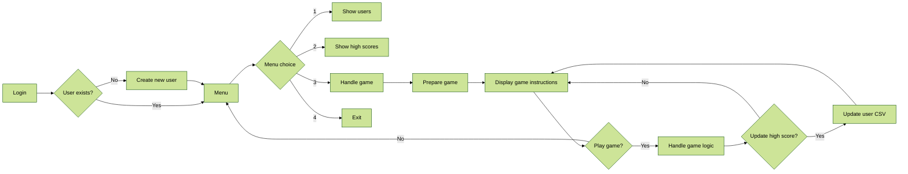

```mermaid

%%{init: {'theme': 'forest', 'themeVariables': { 'fontSize': '16px', 'lineWidth': '2px'}}}%%
graph LR
A[ Login ] --> B{ User exists? }
B -- Yes --> C[ Menu]
B -- No --> D[ Create new user ]
D --> C

C --> E{ Menu choice }
E -- 1 --> F[ Show users ]
E -- 2 --> G[ Show high scores ]
E -- 3 --> H[ Handle game ]
E -- 4 --> I[ Exit ]

H --> J[ Prepare game ]
J --> K[ Display game instructions ]
K --> L{ Play game?}
L -- Yes --> M[ Handle game logic ]
M --> N{ Update high score?}
N -- Yes --> O[ Update user CSV ]
O --> K
N -- No --> K
L -- No --> C
```